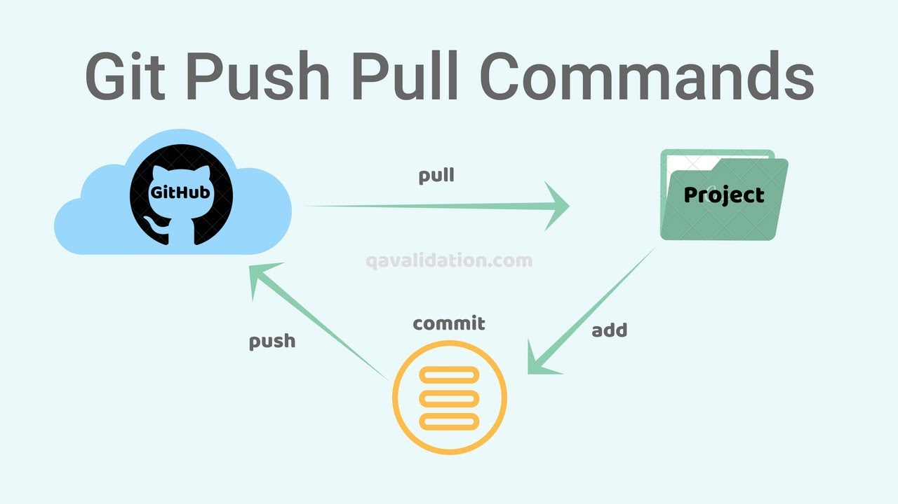

# Tech201-git-github
Tech201-git-github
## Heading 2
### Heading 3
- Let's create our own Markdown file

- This line is added on localhost

- create new folder      name

 mkdir     tech201_github

- to get into git directory to get onto path

cd tech201_github/
(tab to auto-complete)

- to clear screen

clear

- find the absolute path

pwd

- clone information from git to local host, get http address from repo code 

git clone https://github.com/Goldielockz30/Tech201-git-github.git

- to confirm check list directories

ls

- go into updated directory 

cd Tech201-git-github

  
- print working directory

pwd to find absolute path

(shows folder ending with main, for particular task)

- lt should show README.md

- nano README.md

this will take us into the README file locally so we can modify it

  
- to add a new line

- This line is added on

ctrl+x  then press Y and then press enter

- check if added information is saved

cat README.md

- to add it to git

git add .

- check status, if we checked status before add it would have been red

git status

- to save locally

git commit -m "testing github connection"   

- to save globally

git push -u origin main  

- this shows folder where files are committed

ls -a

to go into correct folder

cd and the new path of folder

make sure all files are in the same and correct folder

